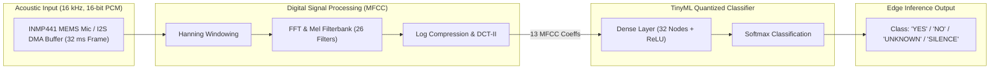

# 🎙️ TinyML Audio Keyword Spotting & MFCC Feature Extractor

[](https://en.wikipedia.org/wiki/C99)
[](https://www.tensorflow.org/lite/microcontrollers)
[-03234C?style=flat-square&logo=arm&logoColor=white)](https://www.arm.com/)
[](https://en.wikipedia.org/wiki/Edge_computing)
[](LICENSE)

An ultra-compact, deterministic **TinyML Audio Keyword Spotting (KWS) Engine** for edge microcontrollers (**ARM Cortex-M4 / STM32F4**). Features real-time **Mel-Frequency Cepstral Coefficients (MFCC)** spectral feature extraction and an 8-bit quantized neural network classifier.

---

## 🔌 Hardware Circuit Diagram & Digital Audio Interface

```
               +3.3V Power Bus
                     |
 +-------------------+---------------------------------------------------+
 |                   |                                                   |
 |                  3V3                                                  |
 |                                                                       |
 |   [ STM32F401 BlackPill MCU ]                                         |
 |                                                                       |
 |       (I2S3 SCK)        (I2S3 WS)        (I2S3 SD)                    |
 |          PB3               PA15             PB5                       |
 +-----------+-----------------+----------------+------------------------+
             |                 |                |
             v                 v                v
 +-----------+-----------------+----------------+------------------------+
 |          SCK                WS               SD                       |
 |                                                                       |
 |               [ INMP441 / SPH0645 MEMS Microphone Module ]            |
 |                                                                       |
 |          VDD               GND              L/R                       |
 +-----------+-----------------+----------------+------------------------+
             |                 |                |
           +3.3V              GND              GND (Left Channel Mode)
```

---

## 🏛️ Edge AI Processing Pipeline



---

## ⚡ Hardware Pinout Matrix

| Microphone Pin | MCU Pin | Alternate Function | Purpose |
| :--- | :--- | :--- | :--- |
| **INMP441 SCK**| `PB3`  | `AF6` (SPI3_SCK / I2S3_CK) | Audio Bit Clock (512 kHz) |
| **INMP441 WS** | `PA15` | `AF6` (SPI3_NSS / I2S3_WS) | Word Select / Frame Clock (16 kHz) |
| **INMP441 SD** | `PB5`  | `AF6` (SPI3_MOSI / I2S3_SD)| Serial Data Output from Microphone |
| **INMP441 L/R**| `GND`  | None (Hardware Tie)        | Left Audio Channel Select |
| **Status LED** | `PA5`  | GPIO Output                | Keyword Detected Indicator |

---

## 🛠️ Build & Verification

```bash
# Compile TinyML engine
gcc -Wall -Wextra -Iinclude src/mfcc_extractor.c src/nn_inference.c src/i2s_mic_driver.c src/main.c -lm -o tinyml_kws

# Run inference simulation
./tinyml_kws

# Generate synthetic audio feature vectors
python tools/audio_feature_generator.py
```

---

## 👤 Author
* **Herambeswar Mandadapu** – [@mandadapuherambeswar-ux](https://github.com/mandadapuherambeswar-ux)
* **LinkedIn:** [Herambeswar Mandadapu](https://linkedin.com/in/herambeswar-mandadapu-5a977a385)
