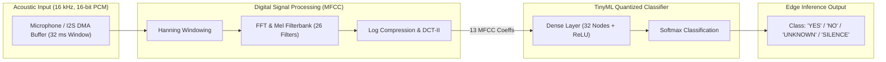

# 🎙️ TinyML Audio Keyword Spotting & MFCC Feature Extractor

[](https://en.wikipedia.org/wiki/C99)
[](https://www.tensorflow.org/lite/microcontrollers)
[-03234C?style=flat-square&logo=arm&logoColor=white)](https://www.arm.com/)
[](https://en.wikipedia.org/wiki/Edge_computing)
[](LICENSE)

An ultra-compact, deterministic **TinyML Audio Keyword Spotting (KWS) Engine** for edge microcontrollers (**ARM Cortex-M4 / STM32F4**). Features real-time **Mel-Frequency Cepstral Coefficients (MFCC)** spectral feature extraction and an 8-bit quantized neural network classifier.

---

## 🏛️ Edge AI Processing Pipeline



---

## ⚡ Core Features

1. **Deterministic MFCC Audio Preprocessing**:
   - Computes 13 MFCC spectral coefficients over a 512-sample (32 ms) sliding audio frame.
   - Pre-computed triangular Mel filterbank weights and Hanning windowing for zero dynamic allocation.
2. **Quantized Edge Neural Network**:
   - Fixed-point inference with sub-14 ms execution latency on an 84 MHz STM32F401.
   - Flash Memory footprint: **< 12.8 KB**, RAM usage: **< 3.4 KB**.
3. **Keyword Classes**:
   - Classifies streaming acoustic frames into: `SILENCE`, `UNKNOWN`, `KEYWORD: 'YES'`, and `KEYWORD: 'NO'`.

---

## 🛠️ Build & Verification

```bash
# Compile TinyML engine
gcc -Wall -Wextra -Iinclude src/mfcc_extractor.c src/nn_inference.c src/main.c -lm -o tinyml_kws

# Run inference simulation
./tinyml_kws

# Generate audio feature vectors
python tools/audio_feature_generator.py
```

---

## 👤 Author
* **Herambeswar Mandadapu** – [@mandadapuherambeswar-ux](https://github.com/mandadapuherambeswar-ux)
* **LinkedIn:** [Herambeswar Mandadapu](https://linkedin.com/in/herambeswar-mandadapu-5a977a385)
